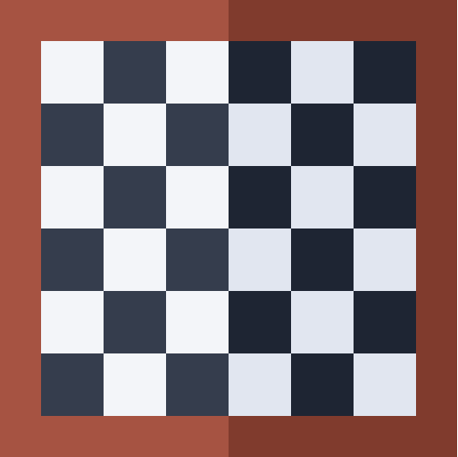
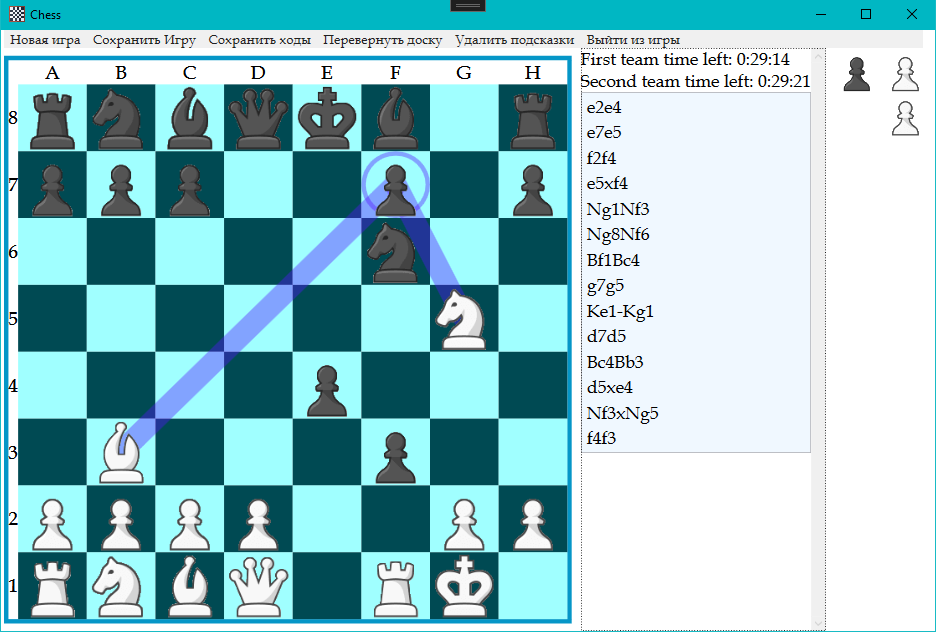
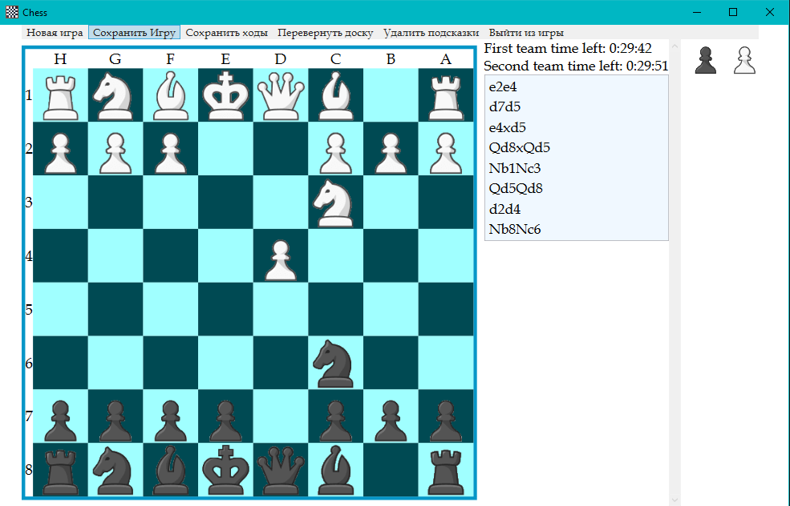
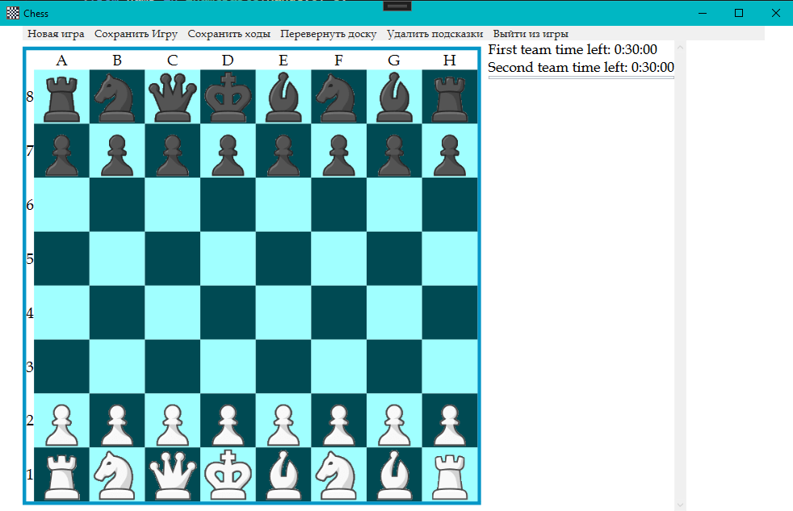
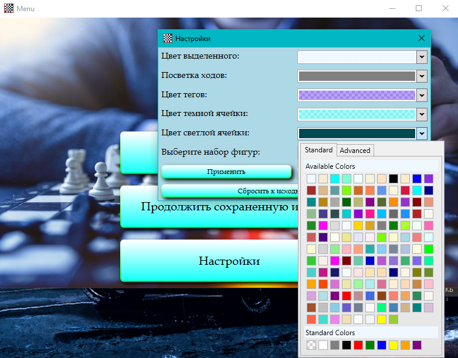
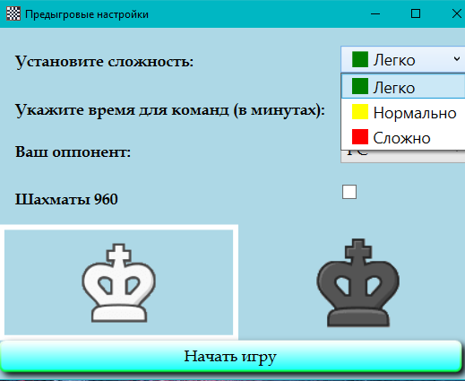

<br />
<div align="center">
  

  <h3 align="center">WPF Chess game</h3>

  <p align="center">
    <a href="https://github.com/EmcTROJ1N/WPFChess/">View Demo</a>
    ·
    <a href="https://github.com/EmcTROJ1N/WPFChess/issues">Report Bug</a>
    ·
    <a href="https://github.com/EmcTROJ1N/WPFChess/issues">Request Feature</a>
  </p>
</div>


<!-- TABLE OF CONTENTS -->
<details>
  <summary>Table of Contents</summary>
  <ol>
    <li>
      <a href="#about-the-project">About The Project</a>
      <ul>
        <li><a href="#built-with">Built With</a></li>
      </ul>
    </li>
    <li>
      <a href="#getting-started">Getting Started</a>
      <ul>
        <li><a href="#prerequisites">Prerequisites</a></li>
        <li><a href="#installation">Installation</a></li>
      </ul>
    </li>
    <li><a href="#usage">Usage</a></li>
    <li><a href="#contributing">Contributing</a></li>
    <li><a href="#contact">Contact</a></li>
    <li><a href="#acknowledgments">Acknowledgments</a></li>
  </ol>
</details>


<!-- ABOUT THE PROJECT -->
## About The Project

This application is a classic chess game implemented in WPF (Windows Presentation Foundation), a technology for creating graphical user interfaces in Windows. 

The application allows you to play chess between two players on the same computer. It also provides the opportunity to play with stockfish 14. Implemented as a chess game mode 960 (chess fischer). 
The application has a simple and intuitive interface that allows players to easily control the pieces and make moves. 
Below is a complete list of functionality:

* Playing with a friend
* Game with a PC with a choice of difficulty
* Playing Chess 960
* Game for time
* Notation, the ability to save it
* Game saving
* Customization and customization of the application appearance (starting with colors, ending with a set of pieces)
* Choice of different colors
* Audio accompaniment, from menus to the sounds of performed moves

<p align="right">(<a href="#readme-top">back to top</a>)</p>


### Built With

The creation of the project involved:

| Technology                                                                                                      |
| ----------------------------------------------------------------------------------------------------------------|
|  |
|                           |
<p align="right">(<a href="#readme-top">back to top</a>)</p>


<!-- GETTING STARTED -->
## Getting Started

For this project to work, you need to meet some requirements:

<ol>
  <li>Windows operating system</li>
  <li>DirectX</li>
  <li>.net framework (.net core)</li>
  <li>Visual Studio (JetBrains Rider or other IDE)</li>
</ol>

<!-- ### Prerequisites

This is an example of how to list things you need to use the software and how to install them.
* npm
  ```sh
  npm install npm@latest -g
  ``` 
No special steps are necessary
-->

### Installation

_Below is an example of how you can instruct your audience on installing and setting up your app. This template doesn't rely on any external dependencies or services._

Clone the repo
   ```sh
   git clone https://github.com/EmcTROJ1N/WPFChess
   ```

<p align="right">(<a href="#readme-top">back to top</a>)</p>

## Gameplay:

### Classic




### Chess 960



### Settings



### Pregame settings



<p align="right">(<a href="#readme-top">back to top</a>)</p>


<!-- ROADMAP -->

<!-- CONTRIBUTING -->
## Contributing

Contributions are what make the open source community such an amazing place to learn, inspire, and create.

If you have a suggestion that would make this better, please fork the repo and create a pull request. You can also simply open an issue with the tag "enhancement".
Don't forget to give the project a star! Thanks again!

<ol>
  <li>Fork the Project</li>
  <li>Commit your Changes (`git commit -m 'Add some AmazingFeature'`)</li>
  <li>Push to the Branch (`git push origin feature/AmazingFeature`)</li>
  <li>Open a Pull Request</li>
</ol>

<p align="right">(<a href="#readme-top">back to top</a>)</p>


<!-- CONTACT -->
## Contact

Your Name - [@pokrov1970](https://t.me/pokrov1970) - 19et72@mail.ru

[Project Link](https://github.com/EmcTROJ1N/WPFChess)

<p align="right">(<a href="#readme-top">back to top</a>)</p>


<!-- ACKNOWLEDGMENTS -->
## Acknowledgments

Use this space to list resources you find helpful and would like to give credit to. I've included a few of my favorites to kick things off!

* [WpfAdvancedToolKit](https://github.com/xceedsoftware/wpftoolkit)
* [Stockfish.NET](https://github.com/Oremiro/Stockfish.NET)

<p align="right">(<a href="#readme-top">back to top</a>)</p>
